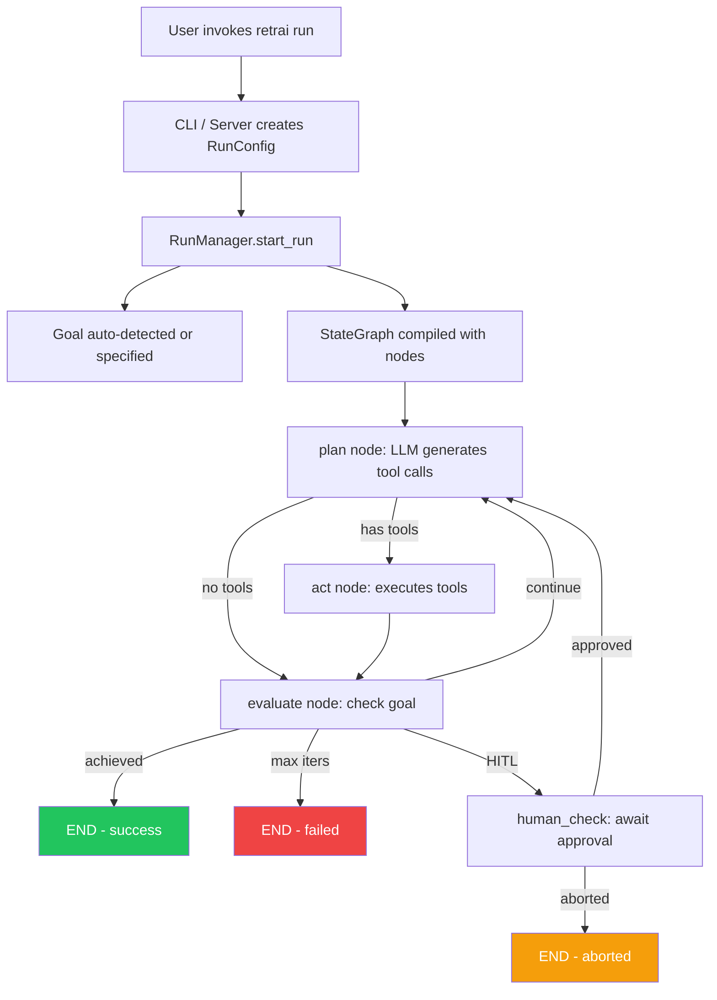

# retrAI — Agent Architecture

This document describes the AI agent system powering retrAI: the autonomous, goal-oriented coding loop that scans a project, runs tests, diagnoses failures, edits source code, and iterates until the goal is achieved.

---

## Overview

retrAI is built on [LangGraph](https://github.com/langchain-ai/langgraph) and uses a **StateGraph** that cycles through four nodes — **plan**, **act**, **evaluate**, and optionally **human_check** — until the goal succeeds or max iterations are reached.

```
START
  │
  ▼
[plan] ──── LLM decides what tools to call ────────────┐
  │                                                     │
  │ has tool calls?                                     │
  ▼                                                     │
[act] ─── executes bash, reads/writes files ───────────┤
  │                                                     │
  ▼                                                     │
[evaluate] ── runs goal.check() ── goal achieved? ─── END
  │                                                     │
  │ not yet, iterations left?                           │
  ├── hitl enabled? ── [human_check] ── approve? ──────┘
  │                                      abort? ── END  │
  │                                                     │
  └──────────────────────────── [plan] ◀────────────────┘
```

Every step emits structured `AgentEvent` objects streamed to CLI, TUI, and WebSocket clients.

---

## Agent State

The graph operates on a shared `AgentState` TypedDict ([state.py](retrai/agent/state.py)):

| Field | Type | Description |
|---|---|---|
| `messages` | `list[BaseMessage]` | Full conversation history (LangGraph `add_messages` reducer) |
| `pending_tool_calls` | `list[ToolCall]` | Tool calls requested by the LLM |
| `tool_results` | `list[ToolResult]` | Results of executed tool calls |
| `goal_achieved` | `bool` | Whether the goal has been met |
| `goal_reason` | `str` | Human-readable status explanation |
| `iteration` | `int` | Current iteration count |
| `max_iterations` | `int` | Hard limit (default 50) |
| `hitl_enabled` | `bool` | Human-in-the-loop mode |
| `model_name` | `str` | LLM model identifier |
| `cwd` | `str` | Project working directory |
| `run_id` | `str` | Unique run identifier (UUID) |
| `total_tokens` | `int` | Cumulative token usage |

---

## Graph Nodes

### 1. Plan (`retrai/agent/nodes/plan.py`)

The "brain" of the agent. Calls the LLM with the full conversation context and tool definitions.

- **System prompt**: Built dynamically from the active goal's `system_prompt()` method, injecting project directory, max iterations, tool descriptions, and strategy instructions.
- **Tool binding**: Binds all 7 tool definitions to the LLM via `llm.bind_tools()`.
- **Context management**: Trims messages to the last 60, always preserving the initial system message to prevent unbounded context growth.
- **Token tracking**: Extracts `usage_metadata` from the LLM response and emits `llm_usage` events.
- **Output**: Extracts `tool_calls` from the AI response into `pending_tool_calls`.

### 2. Act (`retrai/agent/nodes/act.py`)

Executes all pending tool calls sequentially and collects results.

- Dispatches each tool call to its implementation via `_dispatch()`.
- Publishes `tool_call` and `tool_result` events per call.
- Output is truncated (8,000 chars for bash/search, 500 chars for event payloads) to fit LLM context.
- Returns `ToolMessage` objects appended to conversation history.

### 3. Evaluate (`retrai/agent/nodes/evaluate.py`)

Runs the goal's `check()` method against the current state.

- Returns `GoalResult(achieved, reason, details)`.
- Injects a status `HumanMessage` into conversation so the LLM knows progress — encouragement to try different approaches if not yet achieved.
- Handles max-iteration termination.
- Emits `goal_check` and `iteration_complete` events.

### 4. Human Check (`retrai/agent/nodes/human_check.py`)

Optional HITL gate using LangGraph's `interrupt()` mechanism.

- Suspends graph execution until a human responds.
- Accepts: `True`, `"approve"`, `"yes"`, `"continue"` → resumes.
- Anything else → aborts the run.
- Emits `human_check_required` and `human_check_response` events.

---

## Graph Routing

Three router functions ([routers.py](retrai/agent/routers.py)) control flow:

| Router | After | Logic |
|---|---|---|
| `should_call_tools` | `plan` | If `pending_tool_calls` → `act`, else → `evaluate` |
| `route_after_evaluate` | `evaluate` | If achieved → `END`; if max iters → `END`; if HITL → `human_check`; else → `plan` |
| `route_after_human_check` | `human_check` | If aborted or max iters → `END`; else → `plan` |

---

## Tools

All tools operate relative to the project `cwd` and enforce path-traversal protection.

| Tool | File | Description |
|---|---|---|
| `bash_exec` | [bash_exec.py](retrai/tools/bash_exec.py) | Async subprocess execution with configurable timeout. Returns stdout, stderr, exit code. |
| `file_read` | [file_read.py](retrai/tools/file_read.py) | Read file contents (truncated at 200KB). Includes `file_list` for directory listing. |
| `file_write` | [file_write.py](retrai/tools/file_write.py) | Write/create files with auto-created parent directories. |
| `file_patch` | [file_patch.py](retrai/tools/file_patch.py) | Surgical find-and-replace — the old text must appear exactly once. Reports line number of match. |
| `run_pytest` | [pytest_runner.py](retrai/tools/pytest_runner.py) | Runs `pytest --json-report` and returns structured results (pass/fail counts, failure details). |
| `web_search` | [web_search.py](retrai/tools/web_search.py) | DuckDuckGo search with fallback to DDG Lite API. Returns titles, URLs, and snippets. |

### Security

- **Path traversal protection**: `file_read`, `file_write`, and `file_patch` all use `_safe_resolve()` which resolves the path and verifies it stays within the project root.
- **Output truncation**: Bash output is capped at 8,000 chars; file reads at 200KB; pytest failures at 4,000 chars per test.
- **Timeout enforcement**: Bash commands default to 60s; pytest defaults to 120s.

---

## Goals

Goals are pluggable objectives that define *what* the agent is trying to achieve. Each goal extends `GoalBase` ([base.py](retrai/goals/base.py)):

```python
class GoalBase(ABC):
    name: str = "base"

    @abstractmethod
    async def check(self, state: dict, cwd: str) -> GoalResult:
        """Check whether the goal has been achieved."""

    @abstractmethod
    def system_prompt(self) -> str:
        """Return a system prompt fragment describing this goal."""
```

### Registered Goals

| Goal | Class | What it checks |
|---|---|---|
| `pytest` | `PytestGoal` | All pytest tests pass |
| `pyright` | `PyrightGoal` | Zero pyright type errors |
| `bun-test` | `BunTestGoal` | All `bun test` tests pass |
| `npm-test` | `NpmTestGoal` | All `npm test` tests pass |
| `cargo-test` | `CargoTestGoal` | All `cargo test` tests pass |
| `go-test` | `GoTestGoal` | All `go test ./...` tests pass |
| `make-test` | `MakeTestGoal` | `make test` exits 0 |
| `shell-goal` | `ShellGoal` | Custom command from `.retrai.yml` exits 0 |
| `perf-check` | `PerfCheckGoal` | Command completes within time limit |
| `sql-benchmark` | `SqlBenchmarkGoal` | SQL query completes within time limit |
| `ai-eval` | `AiEvalGoal` | AI-generated eval harness passes |

### Auto-Detection

The [detector.py](retrai/goals/detector.py) scans the project directory to pick the right goal:

1. `.retrai.yml` → `shell-goal`
2. `pyproject.toml`/`pytest.ini`/`tests/` → `pytest`
3. `pyrightconfig.json` → `pyright`
4. `Cargo.toml` → `cargo-test`
5. `go.mod` → `go-test`
6. `package.json` + `bun.lock` → `bun-test`
7. `package.json` + jest/vitest → `npm-test`
8. `Makefile` with test target → `make-test`

### AI Eval Planner

The [planner.py](retrai/goals/planner.py) is a meta-agent that generates test harnesses from natural language:

1. Scans the project (file tree + key files + source code).
2. Calls the LLM with a structured prompt to generate a pytest harness.
3. Writes the harness to `.retrai/eval_harness.py`.
4. The implementation agent then runs `ai-eval` to make the harness pass.

---

## LLM Integration

### Factory ([llm/factory.py](retrai/llm/factory.py))

Uses **LangChain + LiteLLM** for universal model support:

```python
@lru_cache(maxsize=32)
def get_llm(model_name: str = "claude-sonnet-4-6", temperature: float = 0.0) -> BaseChatModel:
    return ChatLiteLLM(model=model_name, temperature=temperature)
```

**Supported providers** (via `config.py` PROVIDER_DEFS):

| Provider | Prefix | Auth |
|---|---|---|
| Anthropic (Claude) | `claude-` | `ANTHROPIC_API_KEY` |
| OpenAI | `gpt-`, `o1-`, `o3-`, `o4-` | `OPENAI_API_KEY` |
| GitHub Copilot | — | Device flow OAuth |
| Google (Gemini) | `gemini/` | `GEMINI_API_KEY` |
| Azure OpenAI | `azure/` | `AZURE_API_KEY` + endpoint |
| Ollama (local) | `ollama/` | None (localhost:11434) |

---

## Event System

### Event Types ([events/types.py](retrai/events/types.py))

```
step_start | tool_call | tool_result | goal_check
human_check_required | human_check_response
iteration_complete | run_end | error | log | llm_usage
```

Each event is an `AgentEvent(kind, run_id, iteration, payload, ts)`.

### Event Bus ([events/bus.py](retrai/events/bus.py))

`AsyncEventBus` implements fan-out pub/sub using `asyncio.Queue`:

- `subscribe()` → creates a new queue
- `publish(event)` → broadcasts to all subscribers
- `iter_events(queue)` → async iterator for consumers
- `close()` → sends `None` sentinel to all subscribers

Consumers: CLI logger, TUI panel, WebSocket endpoint.

---

## Run Manager ([server/run_manager.py](retrai/server/run_manager.py))

The `RunManager` orchestrates run lifecycle:

1. **`create(config)`** → Registers a `RunEntry` with its own `AsyncEventBus`.
2. **`start_run(run_id)`** → Builds the graph, initializes state, launches `graph.ainvoke()` as an `asyncio.Task`.
3. **`resume_run(run_id, human_input)`** → Resumes a HITL-paused run.

Run statuses: `pending` → `running` → `achieved` | `failed` | `aborted`.

---

## System Prompt Strategy

The agent's system prompt ([plan.py](retrai/agent/nodes/plan.py) `_build_system_prompt`) defines the agent's persona and behavior:

- **Identity**: "You are retrAI, an autonomous software engineering agent."
- **Strategy**: Understand first → execute scripts → iterate → search when stuck → try alternatives.
- **Critical rules**:
  - Never give up while iterations remain.
  - Never say "I cannot" — the agent has full shell access.
  - Prefer `file_patch` over `file_write` for targeted edits.
  - Always verify changes by running tests.
  - Think step-by-step.

---

## Interfaces

| Interface | Entry Point | Transport |
|---|---|---|
| **CLI** | `retrai run` / `retrai.cli.app` | Direct stdout via event subscription |
| **TUI** | `retrai tui` / `retrai.tui.app` | Textual framework with live event log |
| **Web Dashboard** | `retrai serve` / `retrai.server.app` | FastAPI + WebSocket real-time streaming |

---

## Configuration

### `.retrai.yml`

```yaml
goal: pytest
model: claude-sonnet-4-6
max_iterations: 20
hitl_enabled: false
```

### `RunConfig` Dataclass

```python
@dataclass
class RunConfig:
    goal: str
    cwd: str                    # defaults to current directory
    model_name: str             # defaults to "claude-sonnet-4-6"
    max_iterations: int         # defaults to 50
    hitl_enabled: bool          # defaults to False
    run_id: str                 # auto-generated UUID
```

---

## Data Flow Summary


