# How It Works

retrAI implements a **reinforcement-learning-inspired agent loop** using [LangGraph](https://langchain-ai.github.io/langgraph/). Instead of searching a state space, it uses a large language model to reason about what needs to change and takes targeted code-editing actions until the goal is verified as achieved.

---

## The Agent Loop

```mermaid
graph TD
    S([START]) --> plan
    plan["🧠 Plan<br/><small>LLM decides next actions</small>"]
    plan -->|has tool calls| act
    plan -->|no tool calls| evaluate

    act["⚡ Act<br/><small>Execute tools</small>"]
    act --> evaluate

    evaluate["🎯 Evaluate<br/><small>Run goal.check()</small>"]
    evaluate -->|"✅ achieved"| E([END])
    evaluate -->|"🛑 max iterations"| E
    evaluate -->|"continue + HITL"| human_check
    evaluate -->|"🔄 continue"| plan

    human_check["👤 Human Check<br/><small>Approve or abort</small>"]
    human_check -->|approve| plan
    human_check -->|abort| E

    style plan fill:#7c3aed,color:#fff
    style act fill:#2563eb,color:#fff
    style evaluate fill:#059669,color:#fff
    style human_check fill:#d97706,color:#fff
```



### Nodes

| Node | Responsibility |
|---|---|
| **plan** | Calls the LLM with the full conversation history. Extracts tool calls from the response. Injects the goal's system prompt. |
| **act** | Executes each tool call (bash, file read/write, grep, etc.). Appends results to the message history. |
| **evaluate** | Calls `goal.check()`. Injects a status message. Increments iteration counter. Tracks token usage. |
| **human_check** | *(HITL only)* Interrupts graph execution via LangGraph's `interrupt()`. Waits for a human resume signal. |

### Routing Logic

After each node, a router function decides the next step:

- **After plan** → has pending tool calls → `act`, otherwise → `evaluate`
- **After evaluate** → goal achieved → `END`, max iterations → `END`, HITL → `human_check`, else → `plan`
- **After human_check** → approved → `plan`, aborted → `END`

---

## State

The entire agent state is a single `TypedDict` that flows through the graph:

```python
class AgentState(TypedDict):
    messages: Annotated[list[BaseMessage], add_messages]
    pending_tool_calls: list[ToolCall]
    tool_results: list[ToolResult]
    goal_achieved: bool
    goal_reason: str
    iteration: int
    max_iterations: int
    hitl_enabled: bool
    model_name: str
    cwd: str
    run_id: str
    total_tokens: int
    estimated_cost_usd: float
    failed_strategies: list[str]
    consecutive_failures: int
```

Two things are injected via LangGraph's `config["configurable"]` (not stored in state):

- **`goal`** — the `GoalBase` instance, used by the `evaluate` node
- **`event_bus`** — the `AsyncEventBus`, used by all nodes to emit events

---

## Tools Available to the Agent

The agent has a rich set of tools for code manipulation:

| Tool | Description |
|---|---|
| `bash_exec` | Run any shell command with configurable timeout |
| `file_read` | Read file contents |
| `file_write` | Write/overwrite files, creating directories as needed |
| `file_patch` | Apply targeted patches to files |
| `grep_search` | Search for patterns across files |
| `find_files` | List files matching a pattern |
| `git_diff` | Show unstaged changes |
| `run_pytest` | Run pytest with structured JSON report |
| `python_exec` | Execute Python code in a sandbox |
| `js_exec` | Execute JavaScript/TypeScript via Bun |
| `ml_train` | Train ML models in a sandbox |
| `sql_bench` | Benchmark SQL queries |
| `web_search` | Search the web for documentation |
| `visualize` | Generate charts and plots |
| `hypothesis_test` | Run statistical hypothesis tests |

!!! tip "Auto-context injection"
    On the first iteration, the agent automatically reads key project files (`pyproject.toml`, `package.json`, etc.) to build context before making changes.

---

## Event System

Every agent action publishes a structured `AgentEvent`:

```mermaid
graph LR
    E[AgentEvent] --> WS["🌐 WebSocket"]
    E --> TUI["📟 TUI"]
    E --> CLI["💻 CLI Logger"]

    style E fill:#7c3aed,color:#fff
```



| Event Kind | When Emitted |
|---|---|
| `step_start` | A graph node begins execution |
| `tool_call` | The LLM requests a tool |
| `tool_result` | A tool execution completes |
| `llm_usage` | Token usage from an LLM call |
| `goal_check` | Goal evaluated |
| `human_check_required` | HITL gate reached |
| `iteration_complete` | Full iteration done |
| `run_end` | Run finished (achieved/failed) |

The `AsyncEventBus` uses per-subscriber `asyncio.Queue` objects for concurrent fan-out to all consumers.

---

## Agent Memory

retrAI can persist **learned strategies** across runs. After each successful run, the agent extracts what worked:

```python
# Stored in .retrai/memory.json
{
  "strategies": [
    {
      "goal": "pytest",
      "pattern": "When tests fail due to missing imports, check __init__.py",
      "success_count": 3
    }
  ]
}
```

On subsequent runs, high-confidence strategies are injected into the system prompt so the agent doesn't repeat mistakes.

---

## HITL (Human-in-the-Loop)

With `--hitl`, the agent pauses after each `evaluate` step using LangGraph's `interrupt()` mechanism:

1. `human_check_node` publishes a `human_check_required` event
2. The graph is suspended — persisted in `MemorySaver` checkpointer
3. A human calls `POST /api/runs/{id}/resume` with `{"decision": "approve"}` or `{"decision": "abort"}`
4. The graph resumes from the checkpoint

This allows humans to review each iteration before the agent continues.
