<div class="hero">
  
  <h1>retrAI</h1>
  <p>A self-solving AI agent loop. Point it at any project, give it a goal, watch it fix itself.</p>
  <span class="badge">pytest</span>
  <span class="badge">pyright</span>
  <span class="badge">perf-check</span>
  <span class="badge">sql-benchmark</span>
  <span class="badge">shell-goal</span>
  <span class="badge">ai-eval</span>
  <span class="badge">ml-optimize</span>
  <span class="badge">cargo-test</span>
  <span class="badge">bun-test</span>
  <span class="badge">go-test</span>
</div>

## What is retrAI?

retrAI is an autonomous AI agent that runs a **plan → act → evaluate → repeat** loop powered by [LangGraph](https://langchain-ai.github.io/langgraph/) and [LiteLLM](https://docs.litellm.ai). Give it a goal — failing tests, a slow query, a type error — and it will iteratively fix your code until the goal is achieved.

```mermaid
graph LR
    A[START] --> B[Plan]
    B --> C[Act]
    C --> D[Evaluate]
    D -->|"✅ Goal achieved"| E[END]
    D -->|"🔄 Continue"| B
    D -->|"🛑 Max iterations"| E
```



## Install

```bash
pip install retrai          # or: uv add retrai
```

## Use

```bash
retrai run pytest           # fix all failing tests
retrai run pyright          # fix type errors
retrai run perf-check       # optimise until benchmarks pass
retrai run sql-benchmark    # tune a query until it's fast
retrai run ai-eval          # describe a goal in English, agent writes tests + code
retrai serve                # web dashboard on :8000
retrai tui pytest           # rich terminal UI
```

## Key Features

| Feature | Description |
|---|---|
| :material-target: **12 goal types** | pytest, pyright, bun-test, npm-test, cargo-test, go-test, make-test, shell-goal, perf-check, sql-benchmark, ai-eval, ml-optimize |
| :material-robot: **Multi-model** | Claude, GPT-4o, Gemini, Ollama, DeepSeek — anything [LiteLLM](https://docs.litellm.ai) supports |
| :material-auto-fix: **Auto-detection** | Scans project files to pick the right goal automatically |
| :material-monitor-dashboard: **Web dashboard** | Vue 3 + WebSocket real-time graph visualization |
| :material-console: **TUI** | Rich Textual terminal with live sparklines, tool tree, and event log |
| :material-account-check: **HITL** | Optional human-in-the-loop approval gates before each iteration |
| :material-memory: **Agent memory** | Persists learned strategies across runs |
| :material-pipe: **Pipeline mode** | Chain multiple goals in sequence |
| :material-chart-bar: **Benchmarks** | Compare models side-by-side on the same task |
| :material-magnify: **AI eval** | Describe a goal in English — agent generates the test harness, then implements the solution |

## Quick Links

<div class="grid cards" markdown>

- :material-download: [**Installation**](getting-started/installation.md) — Get up and running in 60 seconds
- :material-rocket-launch: [**Quick Start**](getting-started/quickstart.md) — Fix your first failing test
- :material-cog: [**How It Works**](how-it-works.md) — The agent loop explained
- :material-api: [**API Reference**](api.md) — REST + WebSocket endpoints

</div>
